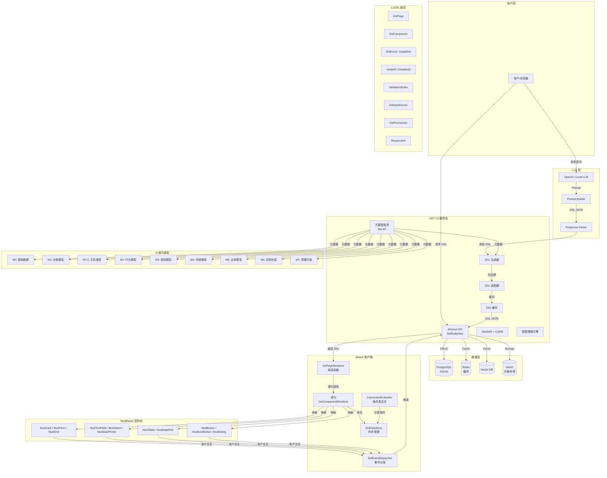
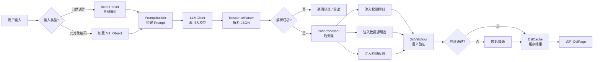
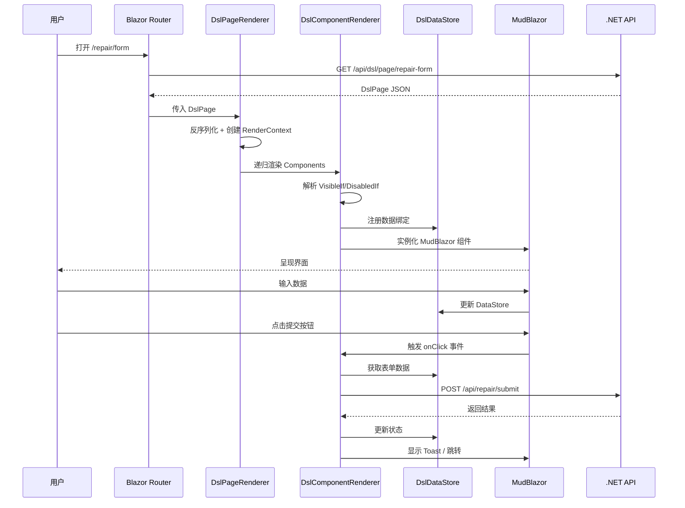
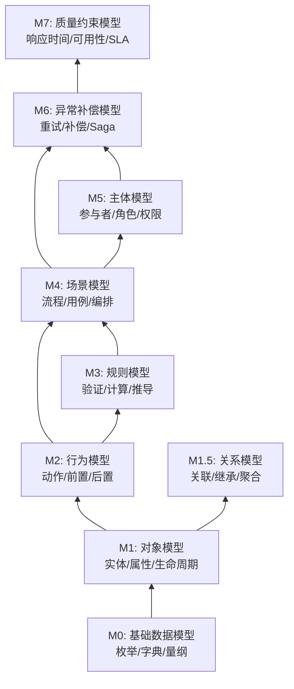

# CJDSL 系统架构 Mermaid 图

## 1. 总体架构



## 2. DSL 生成流水线



## 3. 客户端渲染流程



## 4. 七维元模型层次



## 5. 数据绑定与表达式求值

```mermaid
graph LR
    subgraph "CJDSL 表达式"
        E1["@data.user.name"]
        E2["@user.hasPermission('repair:create')"]
        E3["@row.status == 'completed'"]
        E4["@datasource.totalCount > 0"]
        E5["today() - @data.repairDate < 7"]
    end

    subgraph "ExpressionEvaluator"
        J[Jint / JavaScript 引擎]
        C[上下文注入]
    end

    subgraph "DslDataStore"
        D1[data.user.name = "张三"]
        D2[user.permissions = ["repair:create"]]
        D3[row.status = "pending"]
        D4[datasource.totalCount = 42]
        D5[data.repairDate = 2026-06-10]
    end

    E1 --> J
    E2 --> J
    E3 --> J
    E4 --> J
    E5 --> J
    D1 --> C
    D2 --> C
    D3 --> C
    D4 --> C
    D5 --> C
    C --> J
    J -->|求值结果| R[true/false/string/number]
```
