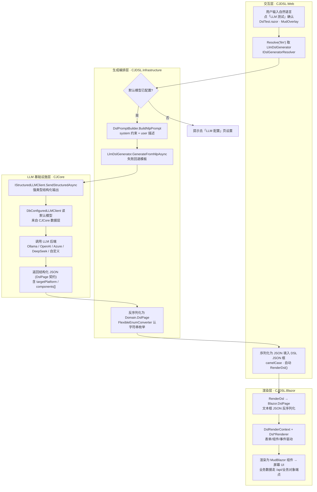

# CJDSL：从自然语言生成前端界面的完整流程

> 本文梳理「在 DSL 测试页输入一句自然语言 → 大模型生成 DSL JSON → 渲染成可交互前端界面」的端到端链路，标注每一环的代码落点、数据形态与关键边界（降级、失败、枚举反序列化）。
> 适用代码基线：模块 J（LLM 收敛到 CJCore）落地后。

## 1. 概述

整条链路分四层，职责边界清晰：

| 层 | 工程 / 程序集 | 职责 |
|----|--------------|------|
| 交互层 | `CJDSL.Web` (`DslTest.razor`) | 采集自然语言、触发生成、回显 DSL JSON、预览 |
| 生成编排层 | `CJDSL.Infrastructure` | 选生成器、拼 Prompt、调结构化 LLM 客户端、反序列化结果 |
| LLM 基础设施层 | `CJCore.Modules.LLM`（模块 J 收敛） | 强类型结构化输出、默认模型路由、调用后端 |
| 渲染层 | `CJDSL.Blazor` | DSL JSON → `DslPage` → MudBlazor 组件上屏 |

核心设计点：**LLM 不是自由 chat，而是「带 JSON Schema 的结构化输出」**——模型被要求严格按 `DslPage` 契约吐 JSON，才能被 `System.Text.Json` 直接反序列化进渲染引擎。

## 2. 端到端流程图

## 3. 分层详解

### 3.1 交互层（蓝 · CJDSL.Web）

- **① 自然语言输入**：`DslTest.razor` 的「LLM 测试」按钮（位于「加载示例」旁）弹出内联 `MudOverlay`，内含多行 `MudTextField` 与确认/取消；生成中显示进度环、按钮禁用防重复提交。
- **② 取生成器**：`GeneratorResolver.Resolve("llm")` 强制走 LLM 生成器。若系统未配默认模型，`IDslGeneratorResolver` 会降级为模板生成器，此时按钮弹 Snackbar 提示「LLM 未配置默认模型，请先到『LLM 配置』页设置」（见图中节点 C 红色分支）。
- **⑪ 回显**：生成成功后，把 `Domain.DslPage` 序列化为 **camelCase 缩进 JSON** 写入 DSL JSON 输入框，并自动调用 `RenderDsl()` 预览。该反序列化/渲染路径与「加载示例」完全共用。

### 3.2 生成编排层（绿 · CJDSL.Infrastructure）

- **④ 构造 Prompt**：`DslPromptBuilder.BuildNlpPrompt(描述, UserContext, options)` 将 `DefaultSystemPrompt`（硬约束 DSL 契约：合法 `targetPlatform = Web|Wpf|Maui|React|Vue`、组件类型、`layout` 等）与自然语言描述拼成 system + user 两段。
- **⑤ 发起生成**：`LlmDslGenerator.GenerateFromNlpAsync(description, user, options)` 调用 `IStructuredLLMClient`。**失败兜底**：LLM 调用异常时返回 `Title="生成失败"` 的回退页，前端提示「LLM 生成失败」而非崩溃。
- **⑩ 反序列化**：LLM 返回的 JSON 反序列化为 `CJDSL.Domain.Entities.Dsl.DslPage`。**此处是历史报 `TargetPlatform` 异常的根**：`StructuredLLMClient` 默认把枚举当数字，遇到字符串 `"Web"` 直接抛 `JsonException`。修复见 §4.1。

### 3.3 LLM 基础设施层（橙 · CJCore，模块 J 收敛）

- **⑥ 强类型结构化**：`IStructuredLLMClient.SendStructuredAsync<T>(system, user, jsonSchema, …)` 把 `DslPage` 的 JSON Schema 一并发给模型，要求模型严格按 schema 输出，返回直接反序列化为强类型 `DslPage`。
- **⑦ 模型来源**：`DbConfiguredLLMClient`（模块 J 收敛产物）从 **CJCore 数据层**（隔离 SQLite `cjdsl_llm.db`）读取「默认模型」配置——即你在「LLM 配置」页设置的那一项。
- **⑧⑨ 真正推理**：按配置路由到 Ollama / OpenAI / Azure / DeepSeek / 自定义后端，拿回结构化 JSON（含 `targetPlatform`、`components[]`、`layout` 等）。

### 3.4 渲染层（紫 · CJDSL.Blazor）

- **⑫ 再反序列化**：`RenderDsl()` 把文本框 JSON 反序列化为 **Blazor 版** `DslPage`（同样走 `FlexibleEnumConverter`；Domain 版多出的 `DataSource/Permission/Responsive/Style` 字段自动忽略）。
- **⑬ 渲染上下文**：每页一个 `DslRenderContext`，持有 `Forms / ComponentRefs / DataStore / EventDispatcher`；各 `Dsl*Renderer`（表单、图表、组件…）据此驱动。
- **⑭ 出 UI + 数据**：最终渲染为 MudBlazor 组件上屏；表单提交/列表等业务数据走 `/api/{objectCode}/{save|submit|list|item/{id}}`（默认内存存储，`UseSqlite=false` 时 `InMemoryBusinessDataService`）。

## 4. 两个关键机制

### 4.1 枚举的「字符串友好」反序列化（已修复）

`TargetPlatform` 成员为 `Web/Wpf/Maui/React/Vue`。`System.Text.Json` 默认把枚举当**数字**反序列化，而 LLM 输出的 JSON 是字符串 `"Web"`，触发 `JsonException: The JSON value could not be converted to CJDSL.Domain.TargetPlatform`。

修复：新增通用 `FlexibleEnumConverter<TEnum>`，数字、字符串（大小写不敏感）、**未知字符串回退 `Web`** 三种情况都能解析，并挂载到 **Domain 版**与 **Blazor 版**两个 `TargetPlatform` 上，覆盖 LLM 路径（⑩）与渲染路径（⑫）两处。该转换器同时让序列化统一输出枚举名字符串，便于阅读/编辑。相关单测见 `TargetPlatformJsonConverterTests.cs`（10 项用例）。

> 为什么不用标准 `JsonStringEnumConverter`：它在部分版本会拒绝数字、对未知字符串抛异常；自带回退的转换器对 LLM 偶发异常输出更稳。

### 4.2 强类型结构化输出（而非自由 chat）

`IStructuredLLMClient` 把 `DslPage` 的 JSON Schema 一并传给模型，约束其输出格式。相比裸对话，这是「自然语言 → 可信 DSL」的关键：模型吐出的 JSON 能被直接反序列化进渲染引擎，否则自由文本根本无法进入渲染链路。

## 5. 配置来源支线（模块 J：配置如何进入 CJCore 数据层）

流程能跑通的前提是「默认模型」已落入 CJCore 数据层。这条支线：

1. **一次性迁移**：`CjdslLlmConfigMigrationProvider`（`ISeedDataProvider`, Order=200）在应用启动时，把旧 `system-config.json` 中激活的 provider **幂等**迁移进 CJCore 数据层，随后清空该 JSON，避免重复迁移。
2. **注册与建库**：`Program.cs` 中 `AddCJCoreLLM(UseOpenAI=false, UseOllama=false, ApiBaseUrl="http://localhost:5000", dataOptions: Provider=Sqlite, ConnectionString="Data Source=cjdsl_llm.db")`，并 `MapCJCoreLLM()`；启动早期 `await app.Services.EnsureDataDbCreatedAsync()` 与 `RunSeedDataAsync()` 完成建表与种子（OpenAI / Ollama / AzureOpenAI / DeepSeek / 自定义）。
3. **配置页服务端回连**：CJCore 内嵌的 `LLMConfigPage` 通过 `ILlmConfigApiClient` 调 `/api/llm/*`；其 `BaseAddress` 由 `ApiBaseUrl` 设定为 `http://localhost:5000`（Blazor Server 下为服务端调用，故应用必须监听该地址，否则报「加载供应商失败: 连接被拒」）。

## 6. 使用前提与排错

**使用前提**：必须先到「LLM 配置」页设好默认模型，否则在节点 ② 即降级提示，不会真正调用模型。

常见现象对照：

| 现象 | 根因 | 处置 |
|------|------|------|
| 点「LLM 测试」提示「LLM 未配置默认模型」 | 默认模型未设置 | 到「LLM 配置」页设置并保存 |
| 「加载供应商失败: 连接被拒 (localhost:5000)」 | 应用未监听 `http://localhost:5000` | 确认 Web 按 `http://localhost:5000` + `https://localhost:5001` 绑定并启动 |
| 生成失败：`TargetPlatform` 无法转换 | 枚举字符串未被识别（旧版本） | 确认已包含 `FlexibleEnumConverter` 修复 |
| 浏览器报「连接不安全 / 发送无效响应」 | 被 HSTS/https 重定向到无 https 监听的端口 | 用 `https://localhost:5001` 访问，或 `http://localhost:5000`；移除 `UseHttpsRedirection`/`UseHsts` |

> 运行约定：Web 默认绑定 `http://localhost:5000` + `https://localhost:5001`（`ApiBaseUrl` 走 http:5000）；构建用 `dotnet build CJDSL.sln -c Debug --disable-build-servers --artifacts-path artifacts` 绕开 obj 锁定。
